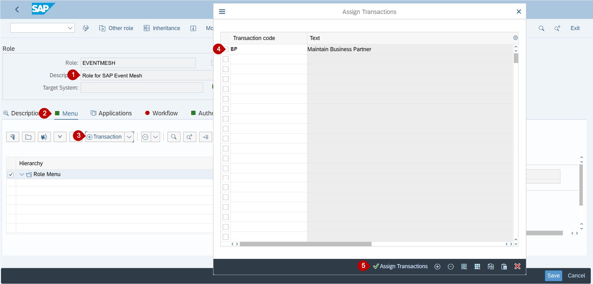
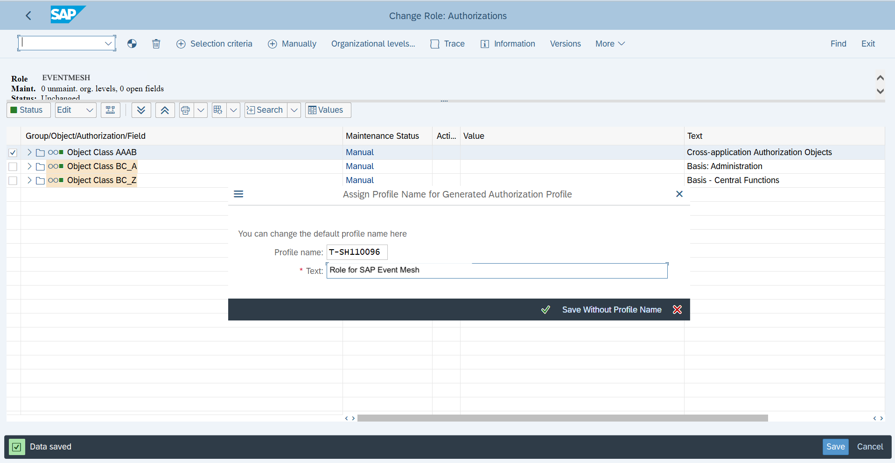

# Prepare SAP S/4HANA System by Activating the Suitable OData Service and Creating a Technical User in SAP S/4HANA System 

## Introduction

We will now switch over to the SAP S/4HANA on premise backend system and enable the OData service we are going to use. Using in this case means that we will replace the mock service in our application with it later on.

Follow these three steps for configuring the OData service in the S/4HANA on premise system: 

1. Activate OData Service in SAP S/4HANA on premise backend system
2. Create a technical user which can access the OData service in the S/4HANA on premise system.
3. Test your OData Service

**Persona:** SAP S/4HANA Admin

### Activate OData Service in SAP S/4HANA on-premise Backend System

1.	Open your SAP S/4HANA on-premise system
2.	Navigate to transaction code: '/IWFND/MAINT_SERVICE'

   

3.	Click on *Add Service* in the Service Catalog

   

4.	Enter *System Alias* 'LOCAL',  *External Service Name* 'API_BUSINESS_PARTNER' and click enter to search for all matching services
5.	Choose the checkbox to select service and click on *Add Selected Services*

   
   
6.	On the next screen, specify *Package Assignment* e.g. $TMP by clicking on *Local Object*
7.	Check checkbox for "Enable OAuth for Service“ and click on *Continue*

   
### Create Technical User and Assign Role

Now we are going to create a user in our SAP S/4HANA backend and assign the required authorizations. 

1.	Go back to your initial screen and navigate to transaction code: 'SU01'

   
   
2.	Enter your Technical User in the field *User*

   
   
3.	Click on "Create button" to create new technical user. 
4.	Change *User Type* to 'Dialog'
5.	Create a new *Password* for your User and repeat it to verify
6.	Switch to the *Address Tab* and add the corresponding lastname to the lastname field. *Save* your Technical User with the save button

   

7.	Navigate to transaction code: '/nPFCG'
8.	Enter 'EVENTMESH' in the *Role* field, then click on the *Single Role* button

 

9.	On the next screen enter a description first, then switch to the *Menu* tab and *save* the role in the pop-up window
10.	Click on the *Transaction* button on the menu tab to enter a new Transaction
11.	Enter the transaction code for which you need to provide access in the pop-up window. In our case enter 'BP'
12.	Click on *Assign Transactions* to finish

     
   
13.	Select 'Authorization Default' from the 'Transaction dropdown' in the menu tab

14. In the pop-up window, select SAP Gateway: Service Groups Metadata as Authorization Default from the dropdown menu

15.	 Enter the name of active Business Partner API - you can look this up using the menu - into to the table and click on *Copy*
   
      
   
16.	Now switch to the *Authorizations* tab and click on *Change Authorization Data* 

    
   
17.	Don´t forget to *Save* the role first
18.	Navigate to *Edit->Insert Authorizations -> From template*

19.	Search for '/IWFND/RT_GW_USER' in the pop-up window and click on the checkmark to apply the template

      
20.	Now click on *Status*, then generate with clicking the icon on the top and *save* the profile in the pop-up
21.	Go back and Switch to the User tab, select your technical user and click on User Comparison and click on full comparisons in the pop-up

22.	Go to transaction /pfcg to open Role Maintenance. 
      > HINT: You can find a detailed explanation of the next steps in this [tutorial](https://pages.github.tools.sap/CPES/CPAppDevelopment-dev/S4HANA_event_setup_2020/)
   
23.	Enter Role as SAP_IWXBE_RT_XBE_ADM and Click on Change Icon.
24.	Switch to *Authorization* Tab and click on *Change Authorization data*
25.	Now click on *Status*, then generate with clicking the icon on the top and *save* the profile in the pop-up
26.	Click on the *generate icon*

   
   
26.	Go back and Switch to the *User* tab, select your technical user and click on *User Comparison* and click on full comparisons in the pop-up   
27.	Log off from the admin user system by entering the transaction '/nEX'
28.	Log on to the GUI using your newly created Technical User

