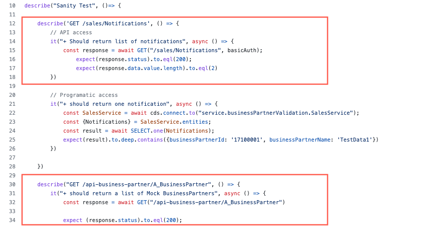
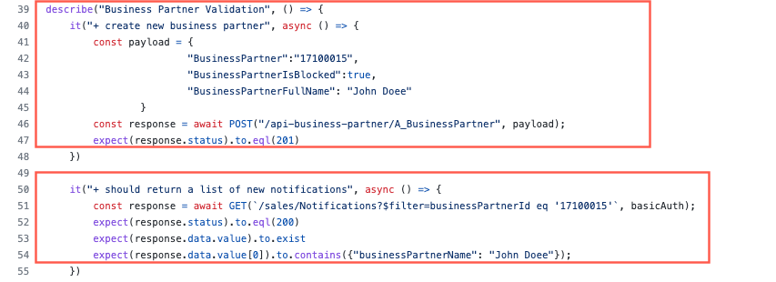

# Run an Integration Test

## Introduction

Now we run a unit test to ensure that all the components of a system are working together as expected. Integration tests are used to test the integration of components such as databases, web services, APIs, and user interfaces. Integration tests are typically performed after unit tests have been completed.

**Persona:** BTP Developer

### Understand the Test Case

1. First you need to write the integration Test. In this exercise there is already a pre prepared integration test created in [GitHub](https://github.com/SAP-samples/cloud-extension-s4hana-business-process/blob/main/tests/integration/BPValidation.test.js). In case you have not cloned the repository in an earlier step, copy the files to your created repository.

2. The test is using the function [_cds.test_](https://cap.cloud.sap/docs/node.js/cds-test), which launches a CAP server in a test environment. 


3. After the service is launched, you can access and test all the service APIs in your application. First it executes a sanity check. A sanity check is a basic level of testing that ensures that the fundamental features of the software application are working as expected before proceeding with more extensive testing.

4. , it is tested if the application can access the APIs for returning notifications as well as for Business Partners



5. After the basic functionality is tested the test script is executing more detailed test. For example a new Business Partner is created and then it is checked if the send notification is returning the correct Business Partner Data



### Run Integration Tests in Your Application

1. Go back to your IDE

2. Open the terminal and run the following test script


```
npm run test:integration

```

