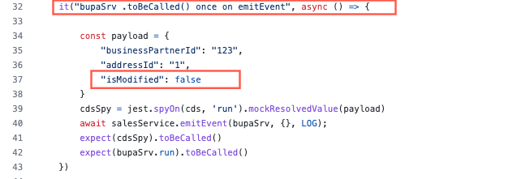
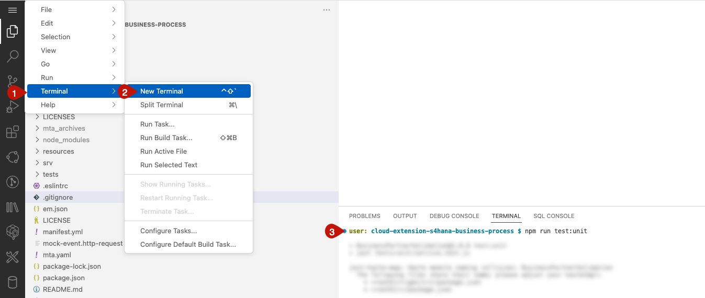

# Run a Unit Test

## Introduction

Now we run a unit test to ensure that individual units of the code are working as expected. Unit tests are usually run automatically, and they can be used to quickly identify any issues with the code.

**Persona:** BTP Developer

### Understand the Test Case

1. To run unit tests for your application, you need to first define which parts of your application need to be tested. In this sample application it is tested if the correct Business Partner is loaded in the application

2. Then you need to write the unit test. In this exercise there is already a pre prepared unit test created in [GitHub](https://github.com/SAP-samples/cloud-extension-s4hana-business-process/blob/main/tests/unit/service.test.js). In case you have not cloned the repository in an earlier step, copy the files to your created repository.

3. First the spyOn method is used to mock the implementation 

4. Then the emitEvent method is tested. The test case checks how many times the emitEvent method is called and if there was a change in the Business Partner data
    - In case the emitEvent method is called once, the isMotified variable is set to false

    

    - In case the emitEvent method is called twice, the isMotified variable is set to true

    

### Run Unit Tests in Your Application

1. Go back to your IDE

2. Open the terminal and run the following test script


```
npm run test:unit

```




3. Check terminal to see results of the test


