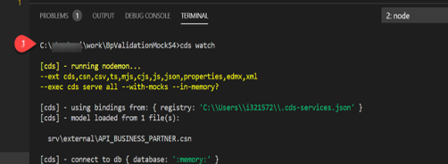

# Develop Demo Application  with mock SAP S/4HANA Service

## Introduction
You will now develop a CAP application using Visual Studio Code. 
**Persona:** BTP Developer

### Set up Node

1.	Open link to [download node](https://nodejs.org/en/)
2.	Choose and download the recommended version for most users
3.	Follow the instructions to install node
> Hint: If you are using a Mac its recommened to install node via Homebrew using command 'brew install node' 

### Prepare your local development environment

1.	Open Visual Studio Code	
2.	Click on *Terminal* and choose *New Terminal* in the dropdown menu
	
   

3.	Install cds with the command: 

```
npm i -g @sap/cds-dk
```

4.	Initialize CDS 
```
cds init BpValidationMockS4
```

### Develop application against Mock API

1. In VS Code choose *File* and choose *Add Folder to Workspace* in the dropdown menu

      

2. Execute the command 
```
cds import API_BUSINESS_PARTNER.edmx
```

Hint: make sure the EDMX file is in your folder or provide the path to the EDMX file. This is the file you have downloaded from the API Business Hub in an earlier step. 


3. Navigate to the *srv/external* folder in the explorer and click right to open the dropdown and choose *New Folder*


4. Name your created folder 'data'

5. Now click right on your created data folder and choose *New File* in the dropdown


6. Name your created file 'API_BUSINESS_PARTNER-A_BusinessPartnerAddress.csv'

7. Now open the file and copy the text on the right into the file:

 ```
 BusinessPartner,AddressID,StreetName,CityName,Country,postalCode 

"17100001","124462","Dietmar-Hopp-Allee 162","Walldorf","DE","12345" 

"17100005","124465","whitefield 162","Bangalore","IN","560066“

```

8.	Save the file

9.	Open the terminal again, and execute
```npm install --save sqlite3```

10. Use cds watch to start a cds server

```
cds watch
```


11.	Click link to open the port in the browser (or copy it into the browser's address bar)


12.	In the *browser* click on A_BusinessPartnerAddress to view the address


 


