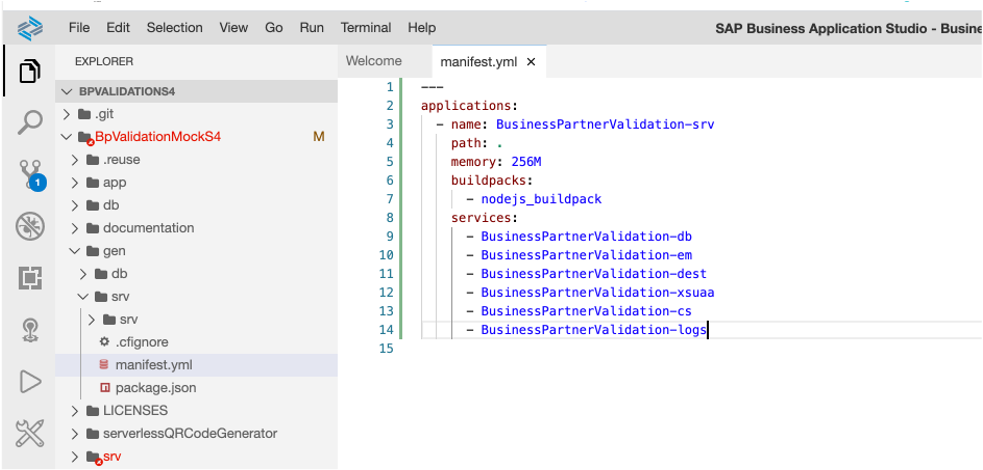

# Develop SAP Cloud Application Programming Model Application

## Introduction

In this how to guide, you will create a new CAP application in SAP Business Application Studio and test your application.

**Persona:** BTP Developer

### Create a new application in SAP Business Application Studio

1.	Make sure you have opened your *SAP BTP Account* and navigate to your *Subaccount* 
   
2.	Open the menu *Services* and navigate to *Instances and Subscriptions*
   
3.	Choose "SAP Business Application Studio" unter the *Subscriptions* tab and click on the icon to open the application
     
     
 
4.	 After opening the home sceen of SAP Business Application Studio, click the button *Create Dev Space*

     
 
5.	On the next screen you will create the new Dev Sapce. For this enter a Dev space name e.g 'BusinessProcess', select the type *SAP Cloud Business Application*. Mark    *Serverless Runtime Development Tools* under additional tools. 
    Don´t forget to click on the button *Create Dev Space*

      
      
 
6.	Your Dev Space is now being created. As soon as the Dev Space is running you can click on your Dev Spaces name to  access

7.	Choose *Terminal -> New Terminal* in the menu on the top of your screen.

    
 
8. In the opened terminal go to projects folder with executing
   
   ``` 
   cd projects
   ``` 
 
9.	 Then clone the project from your personal GitHub and enter username and token to execute the command: 
   ``` 
   git clone <YourPersonalGitHub>
   ``` 
 
10.	Click on *File* in the menu on the top and choose *Open Workspace* in the drop down.

    
 
11.	Open the project by selecting projects -> cloud-extension-s4hana-business-process and click on *Open*

 
12.   For the next steps you need the terminal again. Go to *Terminal* -> *New Terminal*
     
   i. First you need to login. You can find the API Endpoint of your Subaccount in the BTP Cockpit-Overview section:
 
    
    cf api <api endpoint>
    cf login -u <user id> -p <password>
    cf target -o org -s space
    
         
   ii. Then you will get the guid of your HANA Cloud. Please note that, in case that you do not have a HANA Cloud in your SAP BTP environment yet, you will have to create one. You can find a tutorial for creating a HANA Cloud instance [at SAP Help Portal](https://help.sap.com/viewer/db19c7071e5f4101837e23f06e576495/2020_03_QRC/en-US/921f3e46247947779d69b8c85c9b9985.html).
   
	cf create-service hana-cloud hana my_hana_db -c '{"data":{"edition":"cloud","memory":30,"systempassword":""}}'
	cf service --guid
	cf create-service hana hdi-shared BusinessPartnerValidation-db -c '{"database_id" :""}'  
   
            
   
   iii. In a next step, using the guid of your HANA  service, you will create a number of services. You will do this executing the Cloud Foundry Create Service command(cs).
   
     
    cf cs enterprise-messaging default BusinessPartnerValidation-ems -c em.json
    cf cs destination lite BusinessPartnerValidation-dest
    cf cs xsuaa application BusinessPartnerValidation-xsuaa -c xs-security.json
    cf cs connectivity lite BusinessPartnerValidation-cs
    cf cs application-logs lite BusinessPartnerValidation-logs
    cds build --production
               
> HINT: there is an additional way of deployment - either execute the steps before or the two below to achieve the same result: Run *mbt build -p=cf* followed by cf *deploy mta_archives/BusinessPartnerValidation_1.0.0.mtar*


13.	 Open the manifest.yml file and gen/srv folder and add your service names / replace existing ones with your services: ems, dest, xsuaa, db, cs and logs. 
Set the Memory as 256MB. Don´t forget to save the file.

> Hint: to make sure that the services names match, execute the CF command *CF services* which lists the services you have created including their names.

 
 
14.	Go back to the terminal and run following commands:

       ```
       cf p -f gen/db
       cf p -f gen/srv --random-route
       ```
 
15. Optional:
       ```
       cds add mta
       ```
> Hint: This step only needs to be executed in case you have created a new project. As we are using an exsisting project in this tutorial, you can skip this step as the mta file is already added


### Test your application

1. Go to the terminal and enter 
      ```
       mbt build -p=cf
       cf deploy mta_archives/BusinessPartnerValidation_1.0.0.mtar
       ```
2. Start your app with the command
      ```
      cf apps
      ```
3. Open the URL of your deployed UI application

