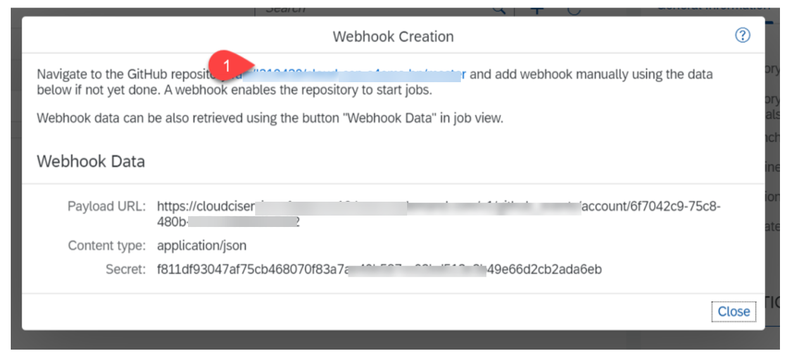
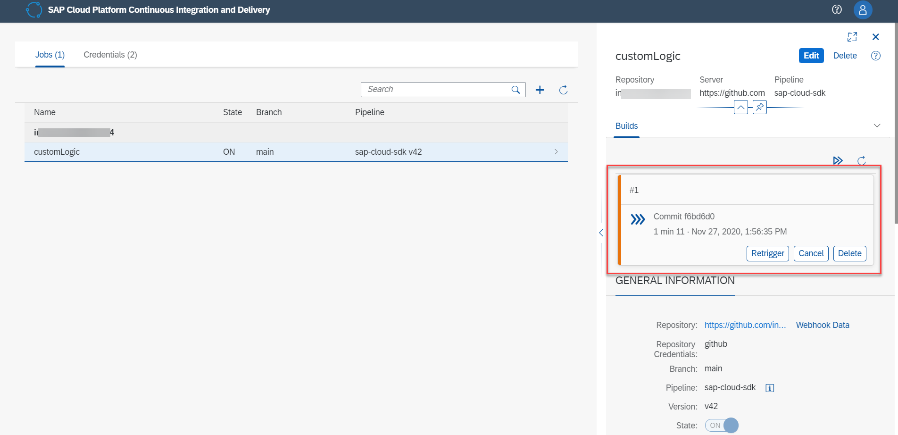

# Setup CI/CD Pipeline

We will now setup our CI/CD pipeline.

1. Open GitHub repository and fork the repository

- Go to the GitHub repository and fork the repository

2. Go to the Business Application Studio 

- Go to the SAP BTP Cockpit
- Go to *Instances and Subscriptions* or to *Service Marketplace*
- Start the Business Application Studio

3. Open a Terminal

- Log in

4. Clone the forked GitHub repository

Execute the command from the projects folder

```bash
git clone <your GitHub repository>
```  

5. Execute the command *cds add pipeline*

6. Open config.yml file and edit with the snippets provided below 

You can find the config.yml file on the left in the Explorer window of the Business Application Studio. Open the directory .pipeline and you will find the file there.

- Go to the *general* section. 
- Copy the below over to the general section

```bash
  unsafeMode: false
  projectName: 'cloud-extension-s4hana-business-process'
  productiveBranch: 'main'
```  
  
- Go to the *steps* section
- Copy and add the below over to the steps section

```bash
  artifactPrepareVersion:
    buildTool: 'mta'
  npmExecute:
    dockerImage: 'ppiper/node-browsers:v2'
  cloudFoundryDeploy:
    dockerImage: 'ppiper/cf-cli'
    mtaDeployParameters: '-f --version-rule ALL'
  mtaBuild:
    mtaBuildTool: "cloudMbt"
```

- Go to the *stages* section
- Copy the below over and add it to the section

```bash
  npmAudit:
    auditedAdvisories:
    # high
      - 550   
      - 593
      - 1184
      - 755
      - 1065 
      - 1164 
      - 1316 
      - 1324 
      - 1325 
    # moderate
      - 535
      - 1300 
```

- Go to the *cftargets* section, uncomment the section and update appropriately

The data can be found in the BTP Cockpit in the *Overview* part of your subaccount. Note that *org* is the org name, not the org id.

7. Push the pipeline code to GitHub.

- git add .
- git commit –m “adding pipeline config”
- git push

Hint: you might have to configure your Git before.

8. Configure pipeline

- Click on subscription
- Click on “Go to application”

 

9. Add credentials

- Click on credentials tab
- Click on ‘+’

 
 
- Provide Name “global”
- Provide username
- Provide password
- Click on create

 
 
- Click on ‘+’
- Provide name ‘github’
- Provide username
- Provide password
- Click on create

 
 
 10. Add jobs
 
- Click on jobs tab
- Click on ’+’
- Enter job name ‘CustomLogic’
- Enter your GitHub repo url
- Select the repository credential from the dropdown. Pick *github*
- Provide branch as main
- Pipeline type – sap-cloud-sdk
- Set logs to –’20’ 
- Click on ‘create’

 
 
11. Configure Webhooks

- Click on the URL provided
 
 
 
- Click on ‘Add webhook’ 
 
 
 
12. Configure Webhooks

The data required below can be found in the CI/CD popup.

- Enter payload url
- Select content type as application/json
- Enter the secret
- Click on ‘Add webhook’

The details to be entered as available in the pop up in CI application.

 

13. Add credential to pipeline

- Open pipeline_config.yml file in github
- Edit credentialId and adjust to the one created.
- Click on Commit change

 
 
 14. Test the pipeline (optional)
 
 - Go to Business Application Studio
 - Make a minor change to for example the Readme.MD like e.g. adding an empty
 - Go to the terminal and execute the commands below
 
 ```bash
git add .
git commit -m "minor change"
git push
```
 - Goto the CI/CD app 
 - Check on the right hand side that the build has been triggered
 
  
 

 
