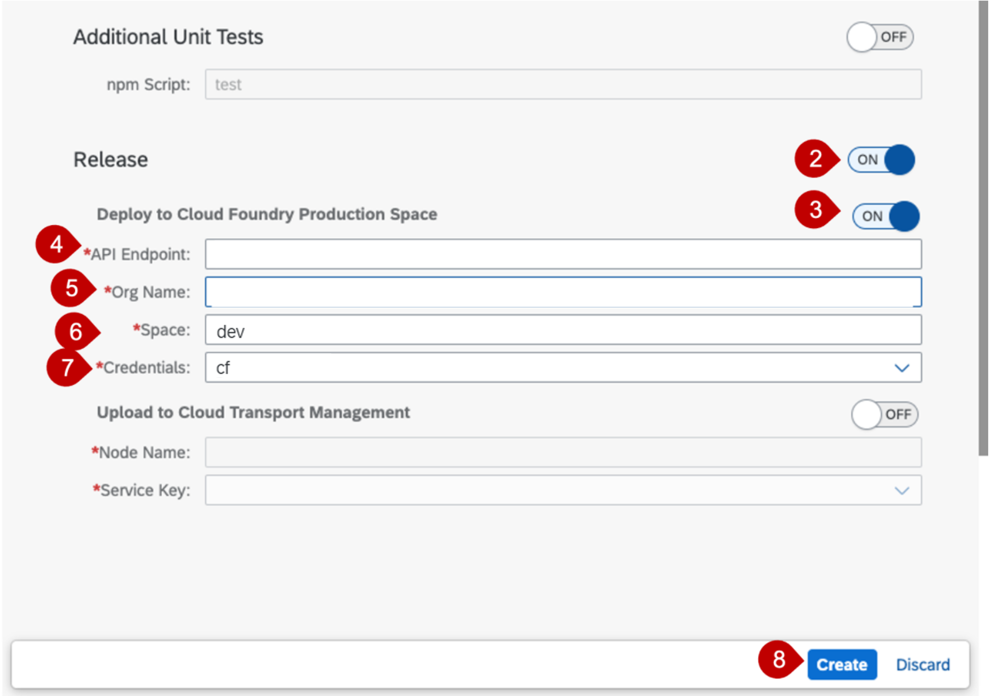

# Setup CI/CD Pipeline

This section describes how to configure and run a predefined continuous integration and delivery (CI/CD) pipeline that automatically tests, builds, and deploys your code changes to speed up your development and delivery cycles.

The steps below will guide your through settting up your pipeline.

1. Enable SAP Continuous Integration and Delivery (optional Step - if you have executed the Booster you should be good)
- Go to your subaccount in SAP BTP
- Got to the Service Marketplace
- Type Continuous into the Search Box
- Choose Create

 

2. Assign Role Collection

- In your SAP BTP subaccount, choose Security -> Users
- Choose the name of your identity provider and navigate into it.
- Click on the three dots and choose *Assign Role Collection*

 

- Search for CICD Administrator and add the role to your user

3. Fork the GitHub repository

- Go to the GitHub repository for this mission 
- Fork the GitHub repository

4. Configure pipeline

- Click on *Service Marketplace* or *Instances and Subscriptions*
- Find *Continuous Integration & Delivery* (you might use the search functionality)
- Click on “Go to application”

 
 
 
 5. In the *Jobs* tab of the application click on the "+" to add a new job for SAP Cloud SDK pipeline
 6. Under *General Information* add the following data:
 - Job Name: "customLogic"
 - Repository: Select *add repository*
 
  

 6.1 In the pop-up add following data:
 - Name: "customLogicRepo"
 - Clone Url: provide URL of your repo
 - Credentials: Select *create credentials*
 
  
 
 6.2 In the pop up add following data:
 - Name: "github"
 - Username: add your GitHub username/ id
 - Password: enter your GitHub access token 
 
   
 
  Click on *create* to finish
  6.3 Back on the "Add repository" tab click on *add* button
  6.4 Now your back at the *General Information* tab of the application. Here fill out the missing fields like followed:
  - Branch: master
  - Pipeline: SAP Cloud Application Programming Model
  
 
  
  6.5 Scroll down to *Stages* - *Release* and switch the toggle on
  - Switch on the toggle to deploy to cloud foundry
  - Now add credentials to your cf account
 
  
   
  6.6 Click on *create* to finish and create job
  
  6.7 Switch to the *Repository tab* and click on your created repo
  - On the top right, click on the 3 dots and choose *webhook* data from the dropdown
  - Copy the data from the pop up
  

7. Add Webhook in GitHub

- In your project in GitHub go to the Settings tab.
- From the navigation pane, choose Webhooks.
- Choose Add webhook.

 

8. Configure Webhooks

The data required below can be found in the CI/CD popup.

- Enter payload url
- Select content type as application/json
- Enter the secret

The details to be entered as available in the pop-up in CI/CD.

- Click on ‘Add webhook’

 
 
9. Test the pipeline (optional)
 
 - Goto the CI/CD app 
 - Check on the right hand side that the build has been triggered
 
  
 

 
